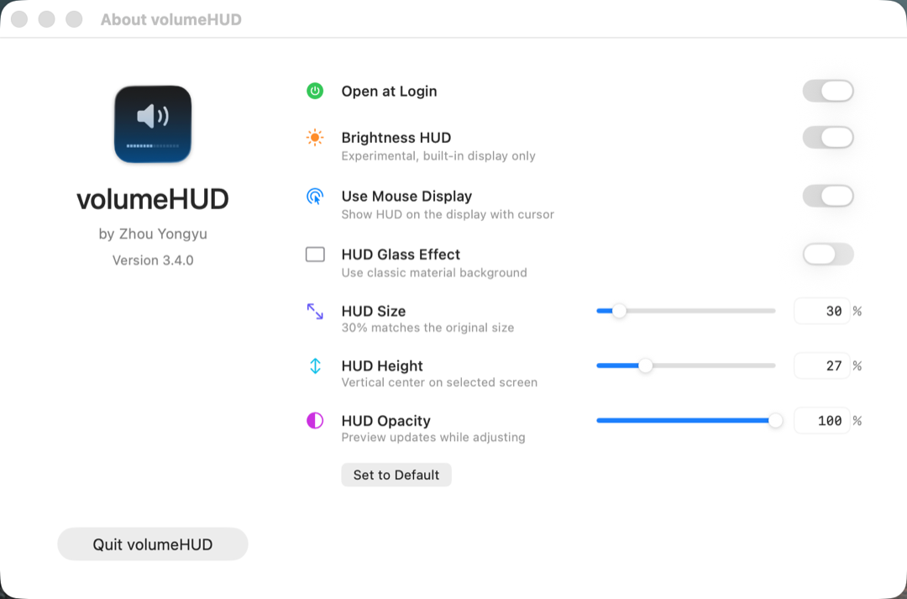
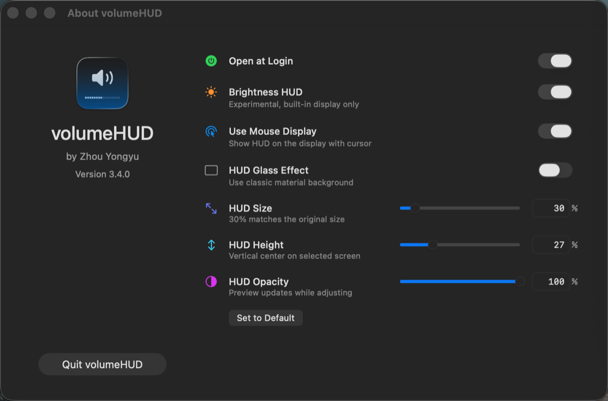

# volumeHUD

  <strong>中文</strong>
  <a href="./README.en.md"><kbd>English</kbd></a>

这是 Danny Stewart 的 [volumeHUD](https://github.com/dannystewart/volumeHUD)
的个人 fork。它保留经典 macOS 音量和亮度 HUD，并加入更多 HUD 外观自定义选项。

本 fork 保留原项目的 MIT 协议和版权署名，并在 [NOTICE](./NOTICE) 中记录本 fork 的修改署名。

## 新增功能

- 可调 HUD 大小，`30%` 对应原版 200 px 大小。
- 可调 HUD 高度，可放到屏幕正中，也可以用 **Set to Default** 恢复原作者默认位置。
- 可调 HUD 透明度。
- 可选原生 Liquid Glass 风格 HUD 背景。
- 调整大小、高度、透明度和玻璃效果时实时预览 HUD。
- 滑块右侧支持直接输入百分比数值。
- 设置页滑块使用干净的自定义轨道，移除了系统滑块下方的刻度状视觉噪声。
- 改善浅色、深色、经典材质和 Liquid Glass 模式下图标与进度条的对比度。
- 设置页增加 **Set to Default**，一键恢复原作者的 HUD 外观默认值。
- About 页面显示本 fork 维护者署名。
- 更新检查指向 `samoldsamold/volumeHUD`。

## 截图

  

  
  

## 使用

启动 app 后即可使用音量 HUD。再次启动 app 会打开设置窗口，你可以启用开机启动、亮度 HUD、选择 HUD 显示屏幕、调整 HUD 大小/高度/透明度、切换 Liquid Glass 效果，并退出 app。

亮度 HUD 默认关闭，只支持内建显示器，仍属于实验功能。

volumeHUD 会拦截音量/亮度按键并隐藏系统 HUD。如果按键拦截在你的系统上不可用，app 会自动停止拦截，确保你仍然可以正常调整音量或亮度。

## 安装

从本 fork 的 GitHub Releases 下载最新版：

<https://github.com/samoldsamold/volumeHUD/releases/latest>

本地开发版本也可以直接从 Xcode 构建后复制到 `/Applications`。如果要替换旧版，请先退出正在运行的 volumeHUD，再覆盖 `/Applications/volumeHUD.app`。

## 权限

volumeHUD 会请求两个可选但推荐的权限：

- **通知**：仅用于手动启动时提示 app 已启动。
- **辅助功能**：用于完整拦截音量/亮度按键并隐藏系统 HUD。

没有辅助功能权限时，app 仍可运行，但系统 HUD 可能会同时出现，并且在音量/亮度边界值附近的检测会不完整。

## 故障排查

如果 HUD 行为不稳定，最常见原因是辅助功能权限异常。建议执行一次干净重装：

1. 再次打开 volumeHUD，并点击 **Quit volumeHUD** 完全退出。
2. 打开 **System Settings** -> **Privacy & Security** -> **Accessibility**。
3. 从列表中移除 **volumeHUD**。
4. 删除 `/Applications/volumeHUD.app`。
5. 从本 fork 的最新 release 重新安装。
6. 再次打开 app，并按系统提示重新授予辅助功能权限。

## 许可证

本项目基于 [MIT License](./LICENSE) 开源。

原项目版权归 Danny Stewart 所有。本 fork 保留原版权声明，并在 [NOTICE](./NOTICE) 中加入 ZHOU YONGYU 的修改署名。
